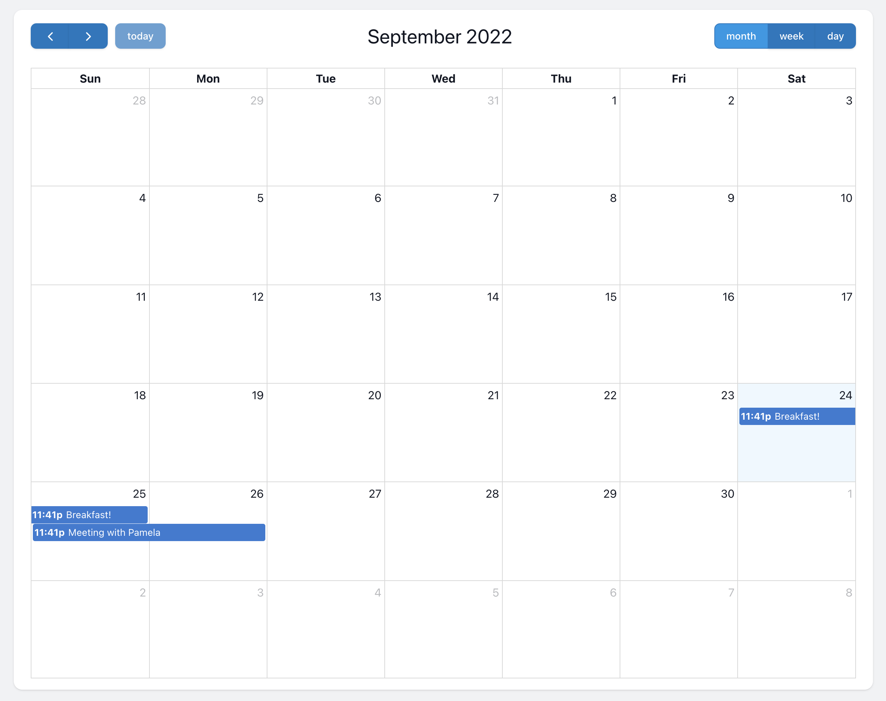

# The Most Popular JavaScript Calendar as a Filament Widget 💛



[](https://packagist.org/packages/saade/filament-fullcalendar)
[](https://github.com/saade/filament-fullcalendar/actions?query=workflow%3Arun-tests+branch%3Amain)
[](https://github.com/saade/filament-fullcalendar/actions?query=workflow%3A"Check+%26+fix+styling"+branch%3Amain)
[](https://packagist.org/packages/saade/filament-fullcalendar)

# Features

-   Accepts all configurations from [FullCalendar](https://fullcalendar.io/docs#toc)
-   Event click and drop events
-   Modals for creating and editing events <sup>New in v1.0</sup>

<br>

## Support Filament

<a href="https://github.com/sponsors/danharrin">

</a>

<br>

# Table of contents

-   [Installation](#installation)
-   [Usage](#usage)
-   [Configuration](#configuration)
-   [Styling](#styling)
-   [Listening for events](#listening-for-events)
-   [Creating and Editing events with modals.](#creating-and-editing-events-with-modals)
    -   [Creating Events](#creating-events)
    -   [Editing Events](#editing-events)
    -   [Authorizing actions](#authorizing-actions)
    -   [Listening for cancelled modal](#listening-for-cancelled-modal)
-   [Refreshing calendar events](#refreshing-calendar-events)
-   [Filtering events based on the calendar view](#filtering-events-based-on-the-calendar-view)

<br>

# Installation

You can install the package via composer:

```bash
composer require saade/filament-fullcalendar
```

You can publish the config file with:

```bash
php artisan vendor:publish --tag="filament-fullcalendar-config"
```

<br>

# Usage

Since the package **does not** automatically add the `FullCalendarWidget` widget to your Filament panel, you are free to extend the widget and customise it yourself.

1. First, create a [Filament Widget](https://filamentadmin.com/docs/2.x/admin/dashboard#getting-started):

```bash
php artisan make:filament-widget CalendarWidget
```

> This will create a new `App\Filament\Widgets\CalendarWidget` class in your project.

<br>

2. Your newly created widget should extends the `Saade\FilamentFullCalendar\Widgets\FullCalendarWidget` class of this package

> **Warning**
>
> Don't forget to remove `protected static string $view` from the generated class!

```php
<?php

namespace App\Filament\Widgets;

use Saade\FilamentFullCalendar\Widgets\FullCalendarWidget;

class CalendarWidget extends FullCalendarWidget
{
    /**
     * Return events that should be rendered statically on calendar.
     */
    public function getViewData(): array
    {
        return [
            [
                'id' => 1,
                'title' => 'Breakfast!',
                'start' => now()
            ],
            [
                'id' => 2,
                'title' => 'Meeting with Pamela',
                'start' => now()->addDay(),
                'url' => 'https://some-url.com',
                'shouldOpenInNewTab' => true,
            ]
        ];
    }

    /**
     * FullCalendar will call this function whenever it needs new event data.
     * This is triggered when the user clicks prev/next or switches views on the calendar.
     */
    public function fetchEvents(array $fetchInfo): array
    {
        // You can use $fetchInfo to filter events by date.
        return [];
    }
}
```

> **Warning**
>
> You should use `getViewData` to display initial data, and `fetchEvents` to fetch new events while paginating the calendar.

> Both methods should retun an array of [EventObject](https://fullcalendar.io/docs/event-object).

<br>

# Configuration

This is the contents of the default config file.

You can use any property that FullCalendar uses on its root object.
Please refer to: [FullCalendar Docs](https://fullcalendar.io/docs#toc) to see the available options. It supports most of them.

### Plugins

You can enable or disable plugins by setting the `plugins` property to `true` or `false`. By default, all non-standard plugins are disabled.

```php
<?php

/**
 * Consider this file the root configuration object for FullCalendar.
 * Any configuration added here, will be added to the calendar.
 * @see https://fullcalendar.io/docs#toc
 */

return [
    'timeZone' => config('app.timezone'),

    'locale' => config('app.locale'),

    'plugins' => [
        'dayGrid' => true,
        'timeGrid' => true,
        'interaction' => true,
        'list' => true,
        'rrule' => true,
        'resourceTimeline' => true,
    ],

    'headerToolbar' => [
        'left'   => 'prev,next today',
        'center' => 'title',
        'right'  => 'dayGridMonth,dayGridWeek,dayGridDay'
    ],

    'navLinks' => true,

    'editable' => true,

    'selectable' => false,

    'dayMaxEvents' => true
];
```

<br>

# Styling

If you're [building a custom Filament theme](https://filamentphp.com/docs/2.x/admin/appearance#building-themes), you need one more step to make the calendar theme match your custom theme.

Add this line to your `resources/css/filament.css` file (or whatever file you're using).

```css
@import '../../vendor/saade/filament-fullcalendar/resources/css/filament-fullcalendar.css';
```

the final contents of this file should look simmilar to this

```diff
@import '../../vendor/filament/forms/dist/module.esm.css';
+ @import '../../vendor/saade/filament-fullcalendar/resources/css/filament-fullcalendar.css';
@import 'tippy.js/dist/tippy.css';

@import 'tailwindcss/base';
@import 'tailwindcss/components';
@import 'tailwindcss/utilities';

```

<br>

# Listening for events

The only event-related events supported right now are: [EventClick](https://fullcalendar.io/docs/eventClick) and [EventDrop](https://fullcalendar.io/docs/eventDrop)

They're commented out by default so livewire does not spam requests without they being used. You are free to paste them in your `CalendarWidget` class. See: [FiresEvents](https://github.com/saade/filament-fullcalendar/blob/main/src/Widgets/Concerns/FiresEvents.php)

Since [v1.0.0](https://github.com/saade/filament-fullcalendar/releases/tag/v1.0.0) we use `onEventClick` to open the edit modal.
If you need to hook up into this event, be sure to call the original method using `parent::onEventClick()` to keep the modal opening as it should.

```php
/**
 * Triggered when the user clicks an event.
 */
public function onEventClick($event): void
{
    parent::onEventClick($event);

    // your code
}

/**
 * Triggered when dragging stops and the event has moved to a different day/time.
 */
public function onEventDrop($newEvent, $oldEvent, $relatedEvents): void
{
    // your code
}

/**
 * Triggered when event's resize stops.
 */
public function onEventResize($event, $oldEvent, $relatedEvents): void
{
    // your code
}
```

<br>

# Creating and Editing events with modals.

Since [v1.0.0](https://github.com/saade/filament-fullcalendar/releases/tag/v1.0.0) you can create and edit events using a modal.

To customise the modal, override the following properties in your widget:

-   `protected string $modalWidth`
-   `protected string $modalLabel`
-   `protected bool $modalSlideover`

The process of saving and editing the event is up to you, since this plugin does not rely on a Model to save the calendar events.

## Creating Events

Events can be created in two ways.

-   Clicking on a day (default)
-   Selecting a date range (click and drag across calendar days) (you need to opt-in for this, set `selectable => true` in the config file.)

This will open the Create Event modal.

When the create form gets submitted, it will call the `createEvent` function on your widget. Be sure to add the snippet below to your calendar class.

```php
public function createEvent(array $data): void
{
    // Create the event with the provided $data.
}
```

If the default form does not fullfills your needs, you can override the `getCreateEventFormSchema` and use it like a normal Filament form.

```php
protected static function getCreateEventFormSchema(): array
{
    return [
        Forms\Components\TextInput::make('title')
            ->required(),
        Forms\Components\DatePicker::make('start')
            ->required(),
        Forms\Components\DatePicker::make('end')
            ->default(null),
    ];
}
```

You can override the `getCreateEventModalTitle()` method to change the modal title to a custom one:

```php
public function getCreateEventModalTitle(): string
{
    return __('filament::resources/pages/create-record.title', ['label' => $this->getModalLabel()]);
}
```

You can override the `getCreateEventModalSubmitButtonLabel()` and `getCreateEventModalCloseButtonLabel()` methods to change the modal button labels to custom labels:

```php
public function getCreateEventModalSubmitButtonLabel(): string
{
    return __('filament::resources/pages/create-record.form.actions.create.label');
}

public function getCreateEventModalCloseButtonLabel(): string
{
    return __('filament::resources/pages/create-record.form.actions.cancel.label');
}
```

<br>

## Editing Events

Events can be edited by clicking on an event on the calendar.

This will open the Edit Event modal.

When the edit form gets submitted, it will call the `editEvent` function on your widget. Be sure to add the snippet below to your calendar class.

```php
public function editEvent(array $data): void
{
    // Edit the event with the provided $data.

    /**
     * here you can access to 2 properties to perform update
     * 1. $this->event_id
     * 2. $this->event
    */

    # $this->event_id
    // the value is retrieved from event's id key
    // eg: Appointment::find($this->event);

    # $this->event
    // model instance is resolved by user defined resolveEventRecord() funtion. See example below
    // eg: $this->event->update($data);

}

// Resolve Event record into Model property
public function resolveEventRecord(array $data): Model
{
    // Using Appointment class as example
    return Appointment::find($data['id']);
}
```

If the default form does not fullfills your needs, you can override the `getEditEventFormSchema` and use it like a normal Filament form.

```php
protected static function getEditEventFormSchema(): array
{
    return [
        Forms\Components\TextInput::make('title')
            ->required(),
        Forms\Components\DatePicker::make('start')
            ->required(),
        Forms\Components\DatePicker::make('end')
            ->default(null),
    ];
}
```

You can override the `getEditEventModalTitle()` method to change the modal title to a custom one:

```php
public function getCreateEventModalTitle(): string
{
    return __('filament::resources/pages/create-record.title', ['label' => $this->getModalLabel()]);
}
```

You can override the `getEditEventModalSubmitButtonLabel()` and `getEditEventModalCloseButtonLabel()` methods to change the modal button labels to custom labels:

```php
public function getEditEventModalSubmitButtonLabel(): string
{
    return __('filament::resources/pages/edit-record.form.actions.save.label');
}

public function getEditEventModalCloseButtonLabel(): string
{
    return $this->editEventForm->isDisabled()
        ? __('filament-support::actions/view.single.modal.actions.close.label')
        : __('filament::resources/pages/edit-record.form.actions.cancel.label');
}
```

<br>

## Authorizing actions

If you want to authorize the `view` action, you can override the default authorization methods that comes with this package.

```php
public static function canView(?array $event = null): bool
{
    // When event is null, MAKE SURE you allow View otherwise the entire widget/calendar won't be rendered
    if ($event === null) {
        return true;
    }

    // Returning 'false' will not show the event Modal.
    return true;
}
```

If you want to authorize the `edit` or `create` action, you can override the default authorization methods that comes with this package.

```php
public static function canCreate(): bool
{
    // Returning 'false' will remove the 'Create' button on the calendar.
    return true;
}

public static function canEdit(?array $event = null): bool
{
    // Returning 'false' will disable the edit modal when clicking on a event.
    return true;
}
```

If you want to disable all actions or keep the calendar as it was before [v1.0.0](https://github.com/saade/filament-fullcalendar/releases/tag/v1.0.0), you can return false for all the methods above, or use the convenient concern `CantManageEvents`. It will disable all calendar modals.

```php
class CalendarWidget extends FullCalendarWidget
{
    use CantManageEvents;

    // ...
}
```

<br>

## Listening for cancelled modal

If you want to know when a modal has been cancelled, you can add for the following [Livewire events](https://laravel-livewire.com/docs/2.x/events#event-listeners) to your widgets `$listener` array:

```php
    protected $listeners = [
        'cancelledFullcalendarCreateEventModal' => 'onCreateEventCancelled',
        'cancelledFullcalendarEditEventModal' => 'onEditEventCancelled',
    ];
```

# Refreshing calendar events

If you want to refresh the calendar events, you can call `$this->refreshEvents()` inside your widget class. This will call `getViewData()` and re-render the events on the calendar.

```php
public function yourMethod(): void
{
    $this->refreshEvents();
}
```

<br>

# Filtering events based on the calendar view

If you want to filter your events based on the days that are currently shown in the calendar, you can implement the `fetchInfo()` method from the [CanFetchEvents](https://github.com/saade/filament-fullcalendar/blob/main/src/Widgets/Concerns/CanFetchEvents.php) trait. Add the following code to your calendar widget:

```php
/**
 * FullCalendar will call this function whenever it needs new event data.
 * This is triggered when the user clicks prev/next or switches views.
 *
 * @see https://fullcalendar.io/docs/events-function
 * @param array $fetchInfo start and end date of the current view
 */
public function fetchEvents(array $fetchInfo): array
{
    return [];
}
```

you can filter events based on the timespan `$fetchInfo['start']` and `$fetchInfo['end']`.

example:

```php
public function fetchEvents(array $fetchInfo): array
{
    $schedules = Appointment::query()
        ->where([
            ['start_at', '>=', $fetchInfo['start']],
            ['end_at', '<', $fetchInfo['end']],
        ])
        ->get();

    $data = $schedules->map( ... );

    return $data;
}
```

<br>

## Testing

```bash
composer test
```

## Changelog

Please see [CHANGELOG](CHANGELOG.md) for more information on what has changed recently.

## Contributing

Please see [CONTRIBUTING](.github/CONTRIBUTING.md) for details.

## Security Vulnerabilities

Please review [our security policy](../../security/policy) on how to report security vulnerabilities.

## Credits

-   [Saade](https://github.com/saade)
-   [All Contributors](../../contributors)

## License

The MIT License (MIT). Please see [License File](LICENSE.md) for more information.
